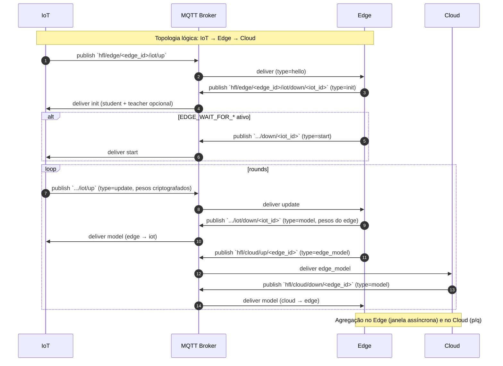

# Sequência de Mensagens MQTT (IoT ↔ Edge ↔ Cloud)

Este diagrama descreve o **fluxo real de mensagens** implementado no sistema, com os **tópicos MQTT** e o papel de cada camada.

## Tópicos e tipos

Tópicos:
- `hfl/edge/<edge_id>/iot/up` → IoT → Edge (`hello`, `update`)
- `hfl/edge/<edge_id>/iot/down/<iot_id>` → Edge → IoT (`init`, `model`, `start`)
- `hfl/cloud/up/<edge_id>` → Edge → Cloud (`hello`, `edge_model`)
- `hfl/cloud/down/<edge_id>` → Cloud → Edge (`init`, `model`)

Tipos de mensagem:
- `hello`: handshake lógico com identificação e target
- `init`: pesos iniciais do *student* (+ teacher opcional)
- `start`: liberação após barreira de prontidão
- `update`: pesos locais criptografados + métricas
- `edge_model`: agregação do edge para o cloud
- `model`: retorno do modelo agregado da camada superior
